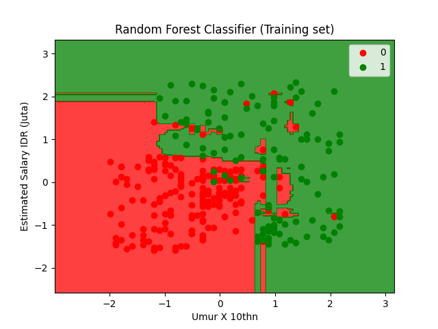
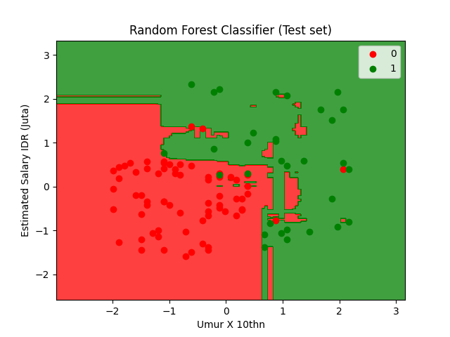

# Tugas UAS Random-Forest-Classifier
### Listyo Arief Nugroho
### 171011400219
### 07TPLE004
### Tugas Kecerdasan Buatan
<br>


Random forest adalah suatu algoritma yang digunakan pada klasifikasi data dalam jumlah yang besar. Klasifikasi random forest dilakukan melalui penggabungan pohon dengan melakukan training pada sampel data yang dimiliki

 
<br>
<br>
<br>

### Intermezzo AI
Data pada file csv merupakan data gaji berdasarkan gender dari perempuan dan laki-laki di rentang usia tertentu dan pada gaji tertenu, untuk hasil akhir dari test result dapat di lihat sebagai berikut pada chart, nanti pada saat result akhir akan di klasifikasi data gender berdasarkan warna dimana ***Laki-Laki*** dengan warna ***Merah*** dan ***Perempuan*** dengan warna ***Hijau***<br>

### Training Set


### Test Set

<br>
<br>

### Install Mdule
```python
pip install $module
```
<br>

### Running Aplikasi
```python
python random_forest_classifier.py
```
